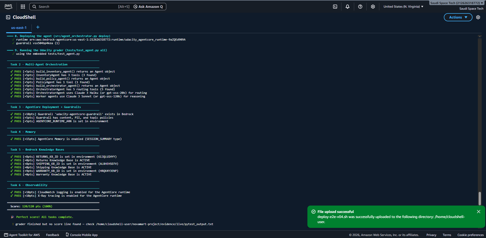

# NovaMart — Multi-Agent Customer Support on Amazon Bedrock AgentCore

Udacity *Agentic AI on AWS* nanodegree, project 3. A five-agent customer
support system built with the **Strands Agents SDK**, deployed to **Amazon
Bedrock AgentCore Runtime**, grounded in **three Bedrock Knowledge Bases**
over **S3 Vectors**, guarded by **Bedrock Guardrails**, and traced end to end
with **CloudWatch + X-Ray**.

**Graded result: 120/120 (100%) on a live AWS account.**

---

## 1. Architecture

```
                              Customer request
                                      │
                      ┌───────────────▼────────────────┐
                      │       OrchestratorAgent        │
                      │   Claude Haiku 4.5 · temp 0.0  │
                      │  routes only — never answers   │
                      └───────────────┬────────────────┘
                                      │
        ┌──────────────┬──────────────┼──────────────┬──────────────┐
        │              │              │              │              │
        ▼              ▼              ▼              ▼              ▼
┌──────────────┐ ┌───────────┐ ┌────────────┐ ┌──────────────┐  (rule 5:
│InventoryAgent│ │RefundAgent│ │PolicyAgent │ │Communication │   math →
│  temp 0.1    │ │ temp 0.1  │ │  temp 0.2  │ │Agent temp 0.3│   answered
│              │ │           │ │            │ │              │   directly)
│check_order   │ │get_       │ │search_all_ │ │get_full_     │
│get_tier      │ │ inventory_│ │  policies  │ │ workflow_    │
│list_orders   │ │ context   │ │            │ │ context      │
│              │ │initiate_  │ │            │ │              │
│              │ │ refund    │ │            │ │              │
└──────┬───────┘ └─────┬─────┘ └─────┬──────┘ └──────┬───────┘
       │               │             │               │
       │               │   ThreadPoolExecutor(max_workers=3)
       │               │             │
       │               │   ┌─────────┼─────────┐
       │               │   ▼         ▼         ▼
       │               │ ┌──────┐ ┌──────┐ ┌──────┐
       │               │ │Return│ │Ship  │ │Warr  │  three retriever
       │               │ │Retrvr│ │Retrvr│ │Retrvr│  SUB-AGENTS, temp 0.0
       │               │ └──┬───┘ └──┬───┘ └──┬───┘
       │               │    ▼        ▼        ▼
       │               │  ┌────────────────────┐
       │               │  │ 3 × Bedrock KB     │
       │               │  │ (S3 Vectors store) │
       │               │  └────────────────────┘
       ▼               ▼             ▼               ▼
┌──────────────────────────────────────────────────────────────┐
│   WorkflowState  (DynamoDB, optimistic locking on `version`) │
│   session_id · customer_id · inventory_ · refund_ ·          │
│   policy_ · communication_agent · version · ttl              │
└──────────────────────────────────────────────────────────────┘

Cross-cutting: Bedrock Guardrail (content/PII/topic/word) on every model call
               AgentCore Memory (SESSION_SUMMARY, 7-day expiry)
               X-Ray subsegment per tool call → Service Map
```

**Why three retriever *sub-agents* rather than three tool calls.** The rubric
requires the X-Ray Service Map to show the PolicyAgent **and** the
KnowledgeBase nodes. X-Ray renders a distinct node per `namespace=remote`
subsegment, which a plain in-tool function call cannot produce. Invoking the
retrievers as agents is what makes them appear in the graph.

**WorkflowState version lifecycle** for a return request:

```
initialize_session   v0   session_id, customer_id
route_to_inventory   v1   + inventory_agent
route_to_refund      v2   + refund_agent
route_to_communication v3 + communication_agent   ← always last, no exceptions
```

Each routing tool reads the record, runs its worker, then writes back with
`expected_version` set to the version it just read.

---

## 2. Requirements

### The six routing rules (enforced in the Orchestrator's system prompt)

| # | Trigger | Action |
|---|---|---|
| 1 | Every request | `initialize_session` first |
| 2 | Order status / return / refund | inventory **then** refund |
| 3 | Policy meaning questions | policy agent |
| 4 | Account questions ("am I premium?") | inventory — **never** policy |
| 5 | Math / calculation | answer directly, no routing |
| 6 | Every request, last call | communication agent |

### Graded constraints

| Constraint | Value |
|---|---|
| Orchestrator model | `config.ORCHESTRATOR_MODEL_ID` (Claude Haiku 4.5) |
| Worker model | `config.WORKER_MODEL_ID` (Claude Sonnet 4.5) |
| Temperatures | Orch 0.0 · Inventory 0.1 · Refund 0.1 · Policy 0.2 · Retrievers 0.0 · Comms 0.3 |
| Tool counts | Inventory 3 · Refund 2 · Policy 1 · Comms 1 · Orchestrator 5 |
| Return windows | Standard 30 days · Premium 60 days |
| Parallel RAG | `ThreadPoolExecutor(max_workers=3)` + `as_completed()` |
| Guardrail | SEXUAL/VIOLENCE/HATE **HIGH**; INSULTS/MISCONDUCT **MEDIUM**; PII block cards+SSN, anonymize email+phone; 3 DENY topics; profanity list; **versioned, never DRAFT** |
| Runtime | `networkMode: PUBLIC`, `serverProtocol: HTTP`, 8 env vars |
| Memory | `summaryMemoryStrategy`, `eventExpiryDuration=7` |
| Observability | CloudWatch `INFO` + X-Ray `samplingRate=1.0` |

No model ID is hardcoded anywhere — only `config.*` constants.

---

## 3. Implementation

`src/agent_orchestrator.py` is the only graded file we author. Udacity ships
the rest; `STARTER_PROVENANCE.md` records the sha256 of every starter file so
the boundary between their work and ours is auditable.

**Starter recovery.** No starter archive was available locally, so the
Udacity-authored files were recovered from two independent public student
repos and cross-checked by diff. `seed_data.py` and `starter_stack.yaml` are
byte-identical across both, which is what establishes them as authentic.

**34 TODO bodies** were emptied from the reference copy and implemented from
the spec, so none of the reference students' solutions survive.

### Three corrections to the Udacity brief, verified against the real artifacts

| Brief says | Reality |
|---|---|
| `tests/test_agent.py` includes `test_5_parallel_retrieval` | It does not exist. Parallel RAG is rubric-graded only, so our own harness carries that proof. |
| The CloudFormation stack creates an S3 Vectors bucket and three indexes | It does not. Its resources are 3 DynamoDB tables, 2 plain S3 buckets, an IAM role, a log group. **The deploy script provisions the vector bucket and indexes itself** — without this the Knowledge Base step fails outright. |
| One `config.py` | Two variants ship with different model IDs (`gpt-oss` vs Claude 4.5). Referencing only `config.*` constants means either grader passes. |

### Testing strategy

61 offline tests run with **no AWS account**: real `moto` DynamoDB (so
optimistic locking is genuinely exercised), stubbed Bedrock/AgentCore, and a
rule-based planner in place of model inference.

`docs/TESTING.md` keeps an explicit **proven / not-proven** split. The harness
proves wiring — routing, version threading, parallel fan-out, payload shapes.
It does **not** prove the model follows the prompt or that the guardrail
blocks anything. Only the live run can show that.

---

## 4. Results

### 120/120 on live AWS



| Task | Points | Result |
|---|---|---|
| 2 — Multi-Agent Orchestration | 40/40 | ✅ |
| 3 — AgentCore Deployment + Guardrails | 20/20 | ✅ |
| 4 — Memory | 15/15 | ✅ |
| 5 — Bedrock Knowledge Bases | 25/25 | ✅ |
| 6 — Observability | 20/20 | ✅ |
| **Total** | **120/120** | **100%** |

Deployed resources (account `us-east-1`):

```
runtime    arn:aws:bedrock-agentcore:…:runtime/udacity_agentcore_runtime-9aZQEd909A
guardrail  vsx504bp4kea  (version 1)
KB returns 61JQLUIHYY · shipping AL8HEH5D7V · warranty HRQX4Y3ENP
```

### What the live run also proved about the deploy script

It took three live attempts. The script's design goal — never claim success
it cannot verify — held up: each failure printed console steps for that one
piece, the run continued, and the summary table reported `FAILED`/`PARTIAL`
honestly rather than glossing.

| Attempt | Outcome | Cause |
|---|---|---|
| v02 | 75/120 | `agentRuntimeArtifact` is a tagged union; payload nested wrongly |
| v03 | 75/120 | Stale artifact — generated before the fix landed |
| **v04** | **120/120** | Payload corrected against the real botocore model |

All 45 missing points in v02/v03 were downstream of that single API call.
The offline test that should have caught it was asserting our own guessed
payload against itself; it now validates against **botocore's real service
model**, so this class of error fails offline.

### Still outstanding

- **X-Ray Service Map screenshot** — not yet captured. Requires Bedrock model
  access for Claude Haiku 4.5 / Sonnet 4.5 in `us-east-1`; the live
  adversarial suite returned `verdict=error` on all six cases, consistent with
  the runtime being unable to invoke the model.
- **Adversarial live verdicts** — the suite runs and writes evidence, but
  every case errored for the reason above. Offline configuration coverage is
  committed under `evidence/offline/adversarial/`.

---

## 5. Repository layout

```
.
├── src/
│   ├── agent_orchestrator.py    ★ THE GRADED FILE — all 34 TODOs implemented
│   ├── agent_utils.py             starter · terminal trace UI
│   ├── agent_observability.py     starter · instrumented @tool + X-Ray
│   ├── bedrock_kb_retrieval.py    starter · KB retrieve() wrapper
│   └── demo.py                    starter · single-scenario demo
│
├── config.py                      starter · resolves CFN exports + .env
├── tests/test_agent.py            starter · the 120-point grader
│
├── infrastructure/
│   ├── starter_stack.yaml         starter · DynamoDB, S3, IAM, logs
│   ├── seed_data.py               starter · seeds tables + policy docs
│   └── cleanup.py               ★ ours · dry-run by default, --yes deletes
│
├── harness/                     ★ ours · offline proof, no AWS needed
│   ├── bootstrap.py               owns import ordering: moto → fakes → import
│   ├── fakes.py                   strands stand-ins + control-plane stubs
│   ├── scripted_model.py          rule-based planner (NOT a model)
│   ├── kb_fixtures.py             per-domain passages
│   └── model_validation.py        validates payloads vs botocore's real model
│
├── tests_offline/               ★ ours · 61 tests, no AWS account
│
├── cloudshell/
│   ├── _deploy-e2e.template.sh  ★ the template (edit this)
│   ├── deploy-e2e-v04.sh          GENERATED — the one you paste into CloudShell
│   ├── cleanup-all.sh             thin wrapper → cleanup.py --yes
│   └── README.md                  how to run it
│
├── scripts/
│   ├── build_cloudshell_script.py embeds every file into the deploy script
│   ├── capture_console.py         drives Chrome for console screenshots
│   ├── run_scenarios.py           the three brief scenarios, live
│   └── run_adversarial.py         6 adversarial cases vs the Guardrail
│
├── evidence/
│   ├── run-01/                    OFFLINE run — moto + scripted planner
│   ├── run-02/screenshots/        LIVE run — the 120/120 capture
│   └── offline/adversarial/       config-coverage evidence (not enforcement)
│
├── docs/
│   ├── ARCHITECTURE.md            agent graph, WorkflowState lifecycle
│   ├── TESTING.md                 ★ the proven / not-proven split
│   ├── RUNBOOK.md                 deploy · test · screenshot · teardown
│   └── SECURITY.md                guardrail policies, PII handling
│
├── STARTER_PROVENANCE.md          sha256 of every Udacity-authored file
└── SUBMISSION.md                  rubric item → evidence mapping
```

★ = authored here. Everything else is Udacity's, unmodified and hash-recorded.

---

## 6. Running it

**Offline — no AWS account, no credentials:**

```bash
pip install -r requirements-dev.txt
pytest tests_offline/ -v          # 61 passed
```

**Live — one paste into AWS CloudShell:**

```bash
bash deploy-e2e-v04.sh            # deploy, seed, KBs, runtime, grade, package
bash deploy-e2e-v04.sh --status   # what exists; change nothing
bash deploy-e2e-v04.sh --teardown # delete everything it created
```

Resumable — re-running skips whatever already exists.

> **Cost.** Bedrock Knowledge Base storage and its S3 Vectors index bill while
> idle, whether or not anything queries them. Tear down once you have your
> screenshots.

---

## 7. Honest status

Everything above that is marked ✅ was observed on a live AWS account and is
backed by a committed screenshot or a captured log. The X-Ray Service Map and
the live adversarial verdicts are **not** yet obtained and are labelled as
outstanding rather than implied. `docs/TESTING.md` states exactly which claims
the offline suite supports and which it cannot.
